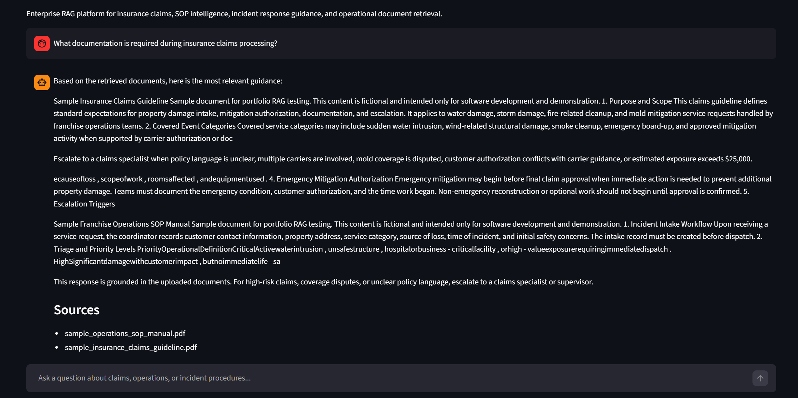
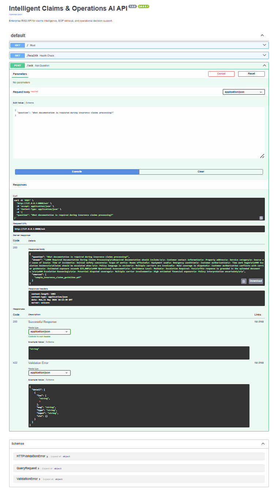
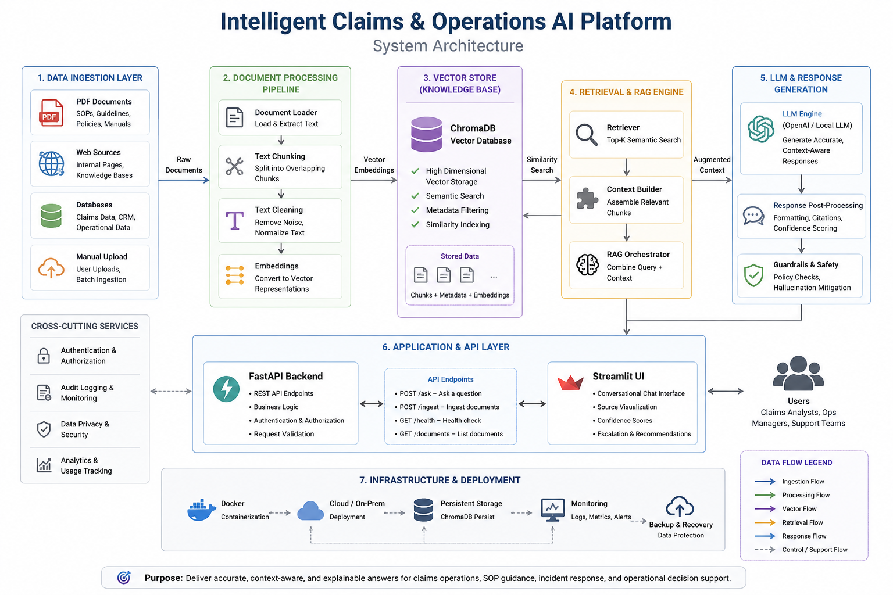

# Intelligent Claims & Operations AI Assistant

Enterprise Retrieval-Augmented Generation (RAG) platform for insurance claims intelligence, SOP retrieval, incident response guidance, and operational decision support.

## Platform Preview

### Conversational RAG Interface



### FastAPI Backend



### System Architecture


---

## Live Features

* Conversational AI assistant interface
* PDF upload and ingestion workflow
* Semantic document retrieval
* Vector database search using ChromaDB
* Local embedding models using SentenceTransformers
* Claims intelligence workflows
* Operational SOP retrieval
* Incident response guidance
* Confidence scoring and escalation logic
* FastAPI backend service
* Streamlit conversational frontend
* Docker deployment support

---

## System Architecture

```text
PDF Documents
      ↓
Document Ingestion Pipeline
      ↓
Text Chunking
      ↓
SentenceTransformer Embeddings
      ↓
Chroma Vector Database
      ↓
Semantic Retrieval Engine
      ↓
Operational Intelligence Layer
      ↓
Confidence Scoring + Escalation Logic
      ↓
FastAPI Backend
      ↓
Streamlit Conversational Interface
```

---

## Core Technologies

### AI / Machine Learning

* Python
* LangChain
* SentenceTransformers
* ChromaDB
* Semantic Retrieval
* Retrieval-Augmented Generation (RAG)
* Vector Search
* HuggingFace Embeddings

### Backend / APIs

* FastAPI
* Uvicorn
* REST API Architecture

### Frontend / Visualization

* Streamlit
* Conversational Chat Interface

### Data Engineering

* PDF Ingestion Pipelines
* Text Chunking
* Document Parsing
* Vector Database Workflows

### Deployment

* Docker
* GitHub

---

## Project Structure

```text
intelligent-claims-operations-ai-platform/
│
├── data/
│   ├── documents/
│   └── processed/
│
├── outputs/
│   ├── figures/
│   └── reports/
│
├── src/
│   ├── app.py
│   ├── api.py
│   ├── ingest_documents.py
│   ├── rag_pipeline.py
│   └── guardrails.py
│
├── vectorstore/
├── requirements.txt
├── Dockerfile
├── .gitignore
└── README.md
```

---

## Key Features

### Document Intelligence

The platform supports:

* Insurance policy analysis
* Claims workflow retrieval
* SOP intelligence
* Incident response guidance
* Operational documentation search
* Source-grounded AI responses

### Conversational AI Interface

The Streamlit frontend provides:

* ChatGPT-style conversational interaction
* Source attribution
* Operational recommendations
* Confidence assessment
* Escalation guidance

### Confidence & Escalation Logic

The system includes enterprise-style workflow logic for:

* Coverage uncertainty detection
* High-risk claims escalation
* Multiple carrier involvement
* Mold dispute escalation
* High financial exposure detection

---

## Example Questions

```text
What documentation is required during insurance claims processing?
```

```text
What operational steps should be taken during severe storm incidents?
```

```text
When should claims be escalated to a supervisor?
```

```text
What information must be documented before emergency mitigation begins?
```

---

## Local Installation

### Clone Repository

```bash
git clone https://github.com/msamad08/intelligent-claims-operations-ai-platform.git
cd intelligent-claims-operations-ai-platform
```

### Create Virtual Environment

```bash
python -m venv .venv
```

### Activate Environment

#### Windows PowerShell

```bash
Set-ExecutionPolicy -Scope Process -ExecutionPolicy Bypass
.venv\Scripts\Activate.ps1
```

### Install Dependencies

```bash
pip install -r requirements.txt
```

---

## Running the Streamlit Application

```bash
python -m streamlit run src/app.py
```

Then open:

```text
http://localhost:8501
```

---

## Running the FastAPI Backend

```bash
python -m uvicorn src.api:app --reload
```

Swagger UI:

```text
http://127.0.0.1:8000/docs
```

---

## PDF Ingestion Workflow

Place PDF documents into:

```text
data/documents/
```

Then run:

```bash
python src/ingest_documents.py
```

This pipeline:

* Loads PDFs
* Splits documents into chunks
* Generates embeddings
* Builds the vector database
* Enables semantic retrieval

---

## Docker Deployment

### Build Docker Image

```bash
docker build -t intelligent-claims-ai .
```

### Run Docker Container

```bash
docker run -p 8501:8501 intelligent-claims-ai
```

---

## Example Enterprise Workflow

1. User uploads claims policy documents
2. Documents are chunked and embedded
3. ChromaDB stores semantic vectors
4. User submits operational question
5. Semantic retrieval finds relevant sections
6. AI assistant generates grounded response
7. Confidence scoring and escalation logic applied
8. Sources returned to user

---

## Future Enhancements

Planned future improvements include:

* LLM-generated summarization
* Authentication and role-based access
* Citation highlighting
* Multi-document reasoning
* Hybrid BM25 + vector retrieval
* Cloud deployment
* CI/CD automation
* Conversation memory
* Agentic workflow orchestration
* Operational analytics dashboard integration

---

## Strategic Portfolio Value

This project demonstrates:

* Enterprise GenAI architecture
* Retrieval-Augmented Generation (RAG)
* Vector database engineering
* Semantic retrieval systems
* FastAPI backend deployment
* Streamlit frontend engineering
* Operational AI workflows
* Decision-support system design
* Claims intelligence automation
* AI-driven document intelligence

---

## Author

Mohammad Samad
Data Scientist | AI & Operational Intelligence | Predictive Analytics | Operations Research

GitHub: https://github.com/msamad08
